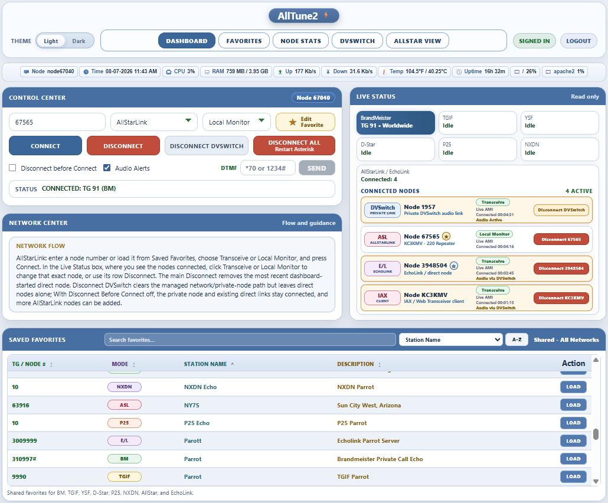

# 🚀 AllTune2

## One Dashboard. All Your Networks.

✅ Optimized for Debian 13 on 64-bit ARM systems, including compatible Raspberry Pi models, and AMD64 (x86_64) platforms.

AllTune2 is a modern control panel for **AllStarLink 3 and DVSwitch-style radio systems**.

It gives you one place to work with:

- BrandMeister
- TGIF
- YSF
- D-Star
- P25
- NXDN
- AllStarLink
- EchoLink
- Local Monitor
- Transceive
- Favorites
- Live status and activity
- Audio alerts

Simple. Clean. Powerful.

---

## ✨ WHAT ALLTUNE2 CAN DO

AllTune2 is meant to be a one-screen radio control center.

With it, you can:

- connect to BrandMeister talkgroups through the native **BMTD** backend
- connect to TGIF talkgroups through the native **TGIFD** backend
- connect to YSF rooms / reflectors when YSF is enabled and already working on your system
- connect to D-Star, P25, and NXDN when those modes are enabled and already working on your system
- connect to AllStarLink nodes
- connect to EchoLink nodes
- change supported AllStarLink, EchoLink, and private DVSwitch connections between Local Monitor and Transceive directly from the **Live Status box — Connected Nodes**
- place an incoming AllStarLink or EchoLink connection in Local Monitor so you can still hear the remote station without sending your transmitted audio back to it
- save, search, sort, and load Favorites
- save a new Favorite directly from the dashboard
- use manual entry
- watch live status and activity
- use spoken audio alerts for connects and disconnects
- open the standalone [**AllStar View**](https://github.com/TerryClaiborne/allstar_view) dashboard from the top navigation when AllStar View is installed on the same system

AllTune2 does not replace ASL3 or Analog_Bridge.

BrandMeister and TGIF now use AllTune2-native backends:

- **BMTD** for BrandMeister
- **TGIFD** for TGIF

These two paths do **not** use STFU, HBLink, MMDVM_Bridge, `MMDVM_Bridge.ini`, or the old DVSwitch DMR sections for their network connection.

YSF, D-Star, P25, and NXDN are different. Those modes still depend on your normal DVSwitch / MMDVM_Bridge setup already working before AllTune2 controls them.

---

<p align="center">
  <a href="screenshot.png">
    
  </a>
</p>

<p align="center">
  <em>AllTune2 dark mode dashboard with multi-network control, Live Status, Favorites, and connected-node tools.</em>
</p>

<p align="center">
  <a href="screenshot-light.png">
    
  </a>
</p>

<p align="center">
  <em>AllTune2 light mode dashboard with the Light/Dark switch, blue/white theme, Favorites, and connected-node tools.</em>
</p>

---

## 🆕 RECENT UI AND CONTROL IMPROVEMENTS

Recent versions added several important improvements:

- redesigned Control Center layout
- cleaner top navigation buttons
- optional [**AllStar View**](https://github.com/TerryClaiborne/allstar_view) navigation button on Dashboard and Favorites that appears only when the standalone AllStar View application is installed
- dashboard **Save Favorite** button
- Save Favorite popup for manual entries
- existing Favorite detection by target + mode
- redesigned Saved Favorites for desktop and cellphone use, with search, sorting, clearer rows, and faster loading
- Live Status box — Connected Nodes cards with quick Favorite and connection controls
- Disconnect DVSwitch button in Live Status
- clickable Transceive / Local Monitor controls in the Live Status box — Connected Nodes for supported AllStarLink, EchoLink, and private DVSwitch connections
- incoming AllStarLink and EchoLink connections can be placed in Local Monitor on your node so you can still hear the remote station without sending your transmitted audio back to it
- spoken connect/disconnect alerts for managed modes
- Apache security hardening from the installer
- optional web login for public or shared dashboards
- View Only mode when logged out
- disabled Control Center, Favorites actions, and Live Status disconnect buttons while logged out
- friendlier Live Status labels using Saved Favorites and local AllStarLink description data when available
- compact connected-node Favorite star for saving or editing AllStarLink and EchoLink nodes directly from Live Status
- confirmed AllStarLink and EchoLink mode changes automatically update the Control Center with the correct network, node, and Link Mode
- expanded EchoLink safeguards for dashboard-initiated links, incoming callers, mode changes, disconnect timeouts, and safe module reset handling
- unsafe outbound EchoLink mode changes are blocked while another EchoLink connection is active so the other connection is not interrupted
- managed-network switching with Disconnect Before Connect no longer removes unrelated AllStarLink or EchoLink connections
- Disconnect Before Connect now uses EchoLink’s protected disconnect timing and cleanup instead of the faster AllStarLink disconnect path
- improved Favorites page with sortable columns, row-click editing, visible Edit buttons, and per-row Remove buttons
- Favorites page now preserves the active sort when editing, saving, or removing entries
- improved update lightning bolt that flashes when a newer GitHub version is available
- hardened Apache access-log filter setup so updates safely handle combined AllTune2 + DVSwitch Cockpit polling filters
- native **BMTD** backend for BrandMeister, replacing the older STFU path
- native **TGIFD** backend for TGIF, replacing the older HBLink sidecar path
- cleaner BMTD/TGIFD logging under the AllTune2 `logs/` directory
- local BMTD/TGIFD config protection so live node credentials are not committed
- AMD64 (x86_64) backend support for BMTD and TGIFD, while keeping the existing ARM/aarch64 path

The dashboard is designed so you can pick a network, enter or load a target, choose Local Monitor or Transceive, and press **Connect**.

---

## ⚠️ BEFORE YOU INSTALL

You must already have a working ASL3 / radio node foundation.

You need:

- Working AllStarLink 3
- Analog_Bridge installed and working for the audio path
- Apache and PHP available for the web dashboard
- A private audio node value you normally use for DVSwitch-style audio linking

### BrandMeister and TGIF

BrandMeister and TGIF no longer use the old MMDVM_Bridge-based DMR paths.

For BrandMeister, AllTune2 uses:

```text
/var/www/html/alltune2/bmtd/config/bmtd.ini
```

For TGIF, AllTune2 uses:

```text
/var/www/html/alltune2/tgif/config/tgifd.ini
```

These files are created from safe example files if they do not already exist.

AllTune2 uses architecture-matched backend binaries for BrandMeister and TGIF:

- ARM/aarch64 systems use `bmtd/bin/bmtd` and `tgif/bin/tgifd`
- AMD64/x86_64 systems use `bmtd/bin/bmtdamd` and `tgif/bin/tgifdamd`

Both architectures use the same live config files shown above. Separate AMD config files are not needed.

BrandMeister and TGIF do **not** require:

- STFU
- HBLink
- MMDVM_Bridge
- `MMDVM_Bridge.ini`
- the old BrandMeister/TGIF settings inside `/opt/MMDVM_Bridge/DVSwitch.ini`

They still use the local Analog_Bridge / TLV audio path.

### YSF, D-Star, P25, and NXDN

YSF, D-Star, P25, and NXDN are separate from the new BMTD/TGIFD paths.

Those modes should already be working in your base DVSwitch / MMDVM_Bridge setup before you enable or use them in AllTune2.

Do not change the working `[General] Id` in:

```text
/opt/MMDVM_Bridge/MMDVM_Bridge.ini
```

just because BMTD and TGIFD no longer use MMDVM_Bridge.

On many DVSwitch systems, the MMDVM_Bridge ID is a hotspot/bridge ID, often the base DMR ID with an added suffix or `+1`. If YSF, D-Star, P25, NXDN, or other MMDVM_Bridge-backed modes are already working, leave the existing `Id` alone.

If your base node is broken, fix that first. AllTune2 is a control panel, not a repair tool for a broken ASL3 / DVSwitch install.

---

## 📥 INSTALL FIRST TIME

Use this only for a brand-new install:

```bash
cd /var/www/html
sudo git clone https://github.com/TerryClaiborne/alltune2.git alltune2
cd alltune2
sudo ./setup_alltune2.sh
```

The installer may take a little while during dependency checks, especially on slower hardware such as a Raspberry Pi 3. Wait for the final setup summary before assuming it is stuck.

### What setup does

The setup script helps with:

- permissions
- sudoers rules
- config examples
- preserving existing local config files
- architecture detection for BMTD/TGIFD backend binaries
- helper permissions
- log rotation
- Apache security hardening
- BMTD runtime checks
- TGIFD runtime checks

The setup script preserves your local config files when they already exist.

A brand-new install may still need you to review and edit:

```text
/var/www/html/alltune2/config.ini
/var/www/html/alltune2/bmtd/config/bmtd.ini
/var/www/html/alltune2/tgif/config/tgifd.ini
```

INI spacing note: AllTune2 accepts normal INI spacing with or without spaces around `=`.

For example, these are both valid:

```ini
MYNODE=12345
MYNODE = 12345
```

Do not add spaces inside embedded option values such as:

```ini
options=StartRef=9990;RelinkTime=60
```

Those values should stay in that compact form.

---

## 🔁 UPDATE / REINSTALL / REBOOT

### Normal code update

For most updates:

```bash
cd /var/www/html/alltune2
git pull origin main
```

### Update that needs setup

Run setup after pulling when the update includes installer, permissions, sudoers, Apache security, BMTD, TGIFD, or other system-level changes:

```bash
cd /var/www/html/alltune2
git pull origin main
sudo ./setup_alltune2.sh
```

**Important for existing users:** After updates that include BMTD/TGIFD backend binary, helper, installer, or permission changes, run `sudo ./setup_alltune2.sh` after pulling. Setup detects the system architecture, checks the matching ARM or AMD64 backend binaries, applies permissions, and reruns the installer self-checks.

**Note for existing users:** If `git status` shows `M data/favorites.txt` after updating, that is normal on a configured node. It only means your saved Favorites are different from the default file. Do not commit your personal `data/favorites.txt`; just run `git pull origin main` and `sudo ./setup_alltune2.sh` as usual.

### Updating from older STFU / HBLink releases

AllTune2 now uses:

- **BMTD** for BrandMeister
- **TGIFD** for TGIF

When updating from an older AllTune2 release that used STFU for BrandMeister or HBLink for TGIF, run setup after pulling:

```bash
cd /var/www/html/alltune2
git pull origin main
sudo ./setup_alltune2.sh
```

The installer creates BMTD/TGIFD starter configs if they are missing and preserves existing live configs when they already exist.

### Reboot when needed

A reboot is recommended after updates that affect long-running runtime pieces such as Analog_Bridge, MMDVM_Bridge, YSF/D-Star/P25/NXDN services, or system service behavior.

Do **not** assume every update needs setup. Many updates only need `git pull`.

---

## ✏️ FILES YOU MUST REVIEW

### 1. Main config

Edit:

```text
/var/www/html/alltune2/config.ini
```

Example:

```ini
MYNODE="YOUR NODE"
DVSWITCH_NODE="YOUR PRIVATE AUDIO NODE"
DSTAR_ENABLED=0
P25_ENABLED=0
NXDN_ENABLED=0
ALLTUNE2_AUTH_ENABLED=0
ALLTUNE2_ADMIN_USER="admin"
ALLTUNE2_ADMIN_PASSWORD_HASH=""
```

### Main config values

**MYNODE**  
Your main AllStar node number.

**DVSWITCH_NODE**  
Your private audio node used for Local Monitor / Transceive linking. Many systems use `1999`, `1998`, or another local private node. Use whatever your system is actually configured to use.

**DSTAR_ENABLED**  
Set to `1` only if D-Star already works on your ASL3 / DVSwitch / MMDVM_Bridge system.

**P25_ENABLED** and **NXDN_ENABLED**  
Set these to `1` only if those modes already work on your ASL3 / DVSwitch / MMDVM_Bridge system.

Leave optional modes disabled if you do not use them:

```ini
DSTAR_ENABLED=0
P25_ENABLED=0
NXDN_ENABLED=0
```

**ALLTUNE2_AUTH_ENABLED**  
Controls the optional AllTune2 web login.

Use:

```ini
ALLTUNE2_AUTH_ENABLED=0
```

to keep AllTune2 in normal no-login mode.

Use:

```ini
ALLTUNE2_AUTH_ENABLED=1
```

to require login before users can control the node.

**ALLTUNE2_ADMIN_USER**  
The single web login username. AllTune2 currently uses one admin account.

Default:

```ini
ALLTUNE2_ADMIN_USER="admin"
```

**ALLTUNE2_ADMIN_PASSWORD_HASH**  
The saved password hash for the AllTune2 web login.

Do **not** type a plain password here.

Normal users should create or change this hash with:

```bash
sudo /var/www/html/alltune2/setup_alltune2.sh --set-admin-password
```

The setup script creates the hash automatically. The plain password is not stored.

---

## 🔐 OPTIONAL WEB LOGIN

AllTune2 can run with or without web login.

### No Login / Normal mode

When this is set:

```ini
ALLTUNE2_AUTH_ENABLED=0
```

AllTune2 works like the normal dashboard. Controls are available without signing in.

### View Only mode

When web login is enabled and you are logged out, AllTune2 shows View Only behavior.

In View Only mode:

- the dashboard still loads
- live status still loads
- saved Favorites are visible
- the Control Center is disabled
- Dashboard Favorites are view-only
- Live Status disconnect buttons are disabled
- Favorites page add/edit/remove actions require login
- connect, disconnect, DTMF, and save actions are blocked

### Login / Sign In

Click **Login** and enter the single admin password.

After signing in, the Control Center, Favorites actions, DTMF, connect, and disconnect controls are available.

### Logout

Click **Logout** to return AllTune2 to View Only mode.

### Set or change the web login password

Run:

```bash
sudo /var/www/html/alltune2/setup_alltune2.sh --set-admin-password
```

This asks for a new admin password, creates the password hash automatically, stores the hash in `config.ini`, and enables web login.

### Disable web login

Run:

```bash
sudo /var/www/html/alltune2/setup_alltune2.sh --disable-auth
```

This sets:

```ini
ALLTUNE2_AUTH_ENABLED=0
```

The existing password hash is kept, so login can be re-enabled later without creating a new password.

Normal setup/update does **not** ask for a password and does **not** change the saved web login settings.

---

## 🔵 BRANDMEISTER / BMTD CONFIG

AllTune2 uses **BMTD** for BrandMeister.

BMTD replaces the older STFU BrandMeister path. BMTD does not use STFU, MMDVM_Bridge, `MMDVM_Bridge.ini`, or the old BrandMeister settings in `/opt/MMDVM_Bridge/DVSwitch.ini`.

Edit:

```text
/var/www/html/alltune2/bmtd/config/bmtd.ini
```

The example file is:

```text
/var/www/html/alltune2/bmtd/config/bmtd.ini.example
```

Existing `bmtd.ini` files are preserved on updates.

BMTD uses an architecture-matched backend binary:

- ARM/aarch64 systems use `/var/www/html/alltune2/bmtd/bin/bmtd`
- AMD64/x86_64 systems use `/var/www/html/alltune2/bmtd/bin/bmtdamd`

Both architectures use the same live `bmtd.ini` file.

### Important

The full `bmtd.ini` file contains required settings that BMTD needs to run. Do not remove sections or change unrelated values unless you know exactly what they do.

For normal setup, only edit the station-specific values below.

### Values you normally need to edit

```ini
[brandmeister]
host=3104.repeater.net
port=54006
password=YOUR_BRANDMEISTER_HOTSPOT_PASSWORD

[identity]
dmr_id=YOUR_DMR_ID
hotspot_radio_id=YOUR_BRANDMEISTER_HOTSPOT_ID
callsign=YOUR_CALLSIGN

[private_node]
mynode="YOUR_ALLSTAR_NODE"
private_node="YOUR_DVSWITCH_NODE"
autoload_mode=transceive
```

### Field notes

**host**  
The BrandMeister master to connect to.

Default example:

```ini
host=3104.repeater.net
```

**port**  
The BrandMeister Rewind port.

Default example:

```ini
port=54006
```

**password**  
Your BrandMeister Hotspot Security password / SelfCare password for this connection.

**dmr_id**  
Your gateway/base DMR ID.

**hotspot_radio_id**  
Your BrandMeister hotspot/radio ID for this BMTD bridge.

This is the hotspot ID BrandMeister expects for the AllTune2 BrandMeister connection.

Example:

```text
Base DMR ID:         3220008
BM hotspot ID:       322000811
hotspot_radio_id:    322000811
```

Do not use the TGIFD `hotspot_radio_id` value unless it is also the correct BrandMeister hotspot ID for your setup.

For many AllTune2 systems:

```text
BrandMeister hotspot_radio_id = BrandMeister hotspot ID
TGIFD hotspot_radio_id        = BrandMeister hotspot ID plus 1
```

Example:

```text
Base DMR ID:                 3220008
BrandMeister hotspot ID:     322000811
TGIFD hotspot ID:            322000812
```

**callsign**  
Your HAM callsign.

**mynode**  
Your main AllStar node number. This should match `MYNODE` in `config.ini`.

**private_node**  
Your private audio node. This should match `DVSWITCH_NODE` in `config.ini`.

**autoload_mode**  
Typical value:

```ini
autoload_mode=transceive
```

### BMTD TLV audio ports

The example config uses the AllTune2 Analog_Bridge / TLV audio port pair:

```ini
[tlv]
rx_port=31103
tx_host=127.0.0.1
tx_port=31100
```

Do not change these unless your Analog_Bridge audio ports are intentionally different.

### BMTD startup talkgroup

The example config uses:

```ini
startup_tg=0
```

Normal dashboard use connects to the talkgroup you enter or select from Favorites. You normally do not need to set a fixed startup talkgroup.

---

## 🟢 TGIF / TGIFD CONFIG

AllTune2 uses **TGIFD** for TGIF.

TGIFD replaces the older TGIF/HBLink sidecar path. TGIFD does not use HBLink, MMDVM_Bridge, `MMDVM_Bridge.ini`, or the old TGIF/HBLink MMDVM profile.

Edit:

```text
/var/www/html/alltune2/tgif/config/tgifd.ini
```

The example file is:

```text
/var/www/html/alltune2/tgif/config/tgifd.ini.example
```

Existing `tgifd.ini` files are preserved on updates.

TGIFD uses an architecture-matched backend binary:

- ARM/aarch64 systems use `/var/www/html/alltune2/tgif/bin/tgifd`
- AMD64/x86_64 systems use `/var/www/html/alltune2/tgif/bin/tgifdamd`

Both architectures use the same live `tgifd.ini` file.

### Important

The full `tgifd.ini` file contains required settings that TGIFD needs to run. Do not remove sections or change unrelated values unless you know exactly what they do.

For normal setup, only edit the station-specific values below.

### Values you normally need to edit

```ini
[identity]
callsign=YOURCALL
dmr_id=YOUR_GATEWAY_DMR_ID
hotspot_radio_id=YOUR_HOTSPOT_ID_PLUS_1

[tgif]
security_key="YOUR_TGIF_SECURITY_KEY"
startup_tg=9990
options=StartRef=9990;RelinkTime=60

[private_node]
mynode="YOUR_ALLSTAR_NODE"
private_node="YOUR_DVSWITCH_NODE"
autoload_mode=transceive
```

### Field notes

**callsign**  
Your HAM callsign.

**dmr_id**  
Your gateway/base DMR ID.

**hotspot_radio_id**  
Your TGIF hotspot/radio ID for this bridge. For the AllTune2 TGIFD path, this is usually your hotspot ID plus 1.

Example:

```text
Hotspot ID:       330000811
hotspot_radio_id: 330000812
```

**security_key**  
Your TGIF Hotspot Security Key. This is not your TGIF website login password.

**startup_tg** and **options**  
The TGIF talkgroup TGIFD should start on when launched directly.

Example for TG 9990:

```ini
startup_tg=9990
options=StartRef=9990;RelinkTime=60
```

Example for TG 9050:

```ini
startup_tg=9050
options=StartRef=9050;RelinkTime=60
```

**mynode**  
Your main AllStar node number. This should match `MYNODE` in `config.ini`.

**private_node**  
Your private audio node. This should match `DVSWITCH_NODE` in `config.ini`.

**autoload_mode**  
Typical value:

```ini
autoload_mode=transceive
```

### TGIFD TLV audio ports

The example config uses the AllTune2 Analog_Bridge / TLV audio port pair:

```ini
[tlv]
rx_port=31103
tx_host=127.0.0.1
tx_port=31100
inbound_slot=2
```

Keep:

```ini
inbound_slot=2
```

for the AllTune2 TGIFD audio path.

### TGIFD `[mmdvm]` note

`tgifd.ini` contains a small `[mmdvm]` section for TGIFD metadata.

That section does **not** mean TGIFD depends on `MMDVM_Bridge.ini` or a running MMDVM_Bridge process.

Keep:

```ini
[mmdvm]
slots=2
```

for the AllTune2 / TLV audio path.

---

## 🟠 OPTIONAL YSF / D-STAR / P25 / NXDN

YSF, D-Star, P25, and NXDN are optional.

Enable them in AllTune2 only if they already work in your base DVSwitch / MMDVM_Bridge setup.

```ini
DSTAR_ENABLED=1
P25_ENABLED=1
NXDN_ENABLED=1
```

If a mode is disabled or not configured, it will not be available in the main dropdown or Favorites. Its Live Status box may still appear, but it will stay idle.

AllTune2 does not create your D-Star registration, P25 setup, NXDN setup, reflector setup, or base MMDVM_Bridge mode configuration. It controls those modes after your base system is already working.

---

## 🚫 DO NOT EDIT THESE UNLESS YOU KNOW WHY

These files belong to the underlying system:

- `/opt/Analog_Bridge/Analog_Bridge.ini`
- `/opt/MMDVM_Bridge/DVSwitch.ini`
- `/opt/MMDVM_Bridge/MMDVM_Bridge.ini`

Important distinction:

- BrandMeister/BMTD and TGIF/TGIFD use their own AllTune2 config files.
- YSF, D-Star, P25, and NXDN still depend on your normal DVSwitch / MMDVM_Bridge configuration.

If those underlying files are wrong for the modes that use them, AllTune2 may not work correctly.

---

## 🌐 OPEN ALLTUNE2 IN YOUR BROWSER

Example:

```text
http://192.168.1.120/alltune2/public/
```

The full path also works:

```text
http://192.168.1.120/alltune2/public/index.php
```

Replace `192.168.1.120` with your node IP address or hostname.

### Outside access and HTTPS

For outside access, the safest recommendation is still Tailscale, a VPN, or another private tunnel you control.

If you want public browser access, use a real hostname or DDNS name with a trusted HTTPS certificate.

Example:

```text
https://your-ddns-name/alltune2/public/
```

A DDNS name alone does not create trusted HTTPS. Apache still needs a trusted certificate for that hostname, such as a Let’s Encrypt certificate.

A common Let’s Encrypt / Certbot path is:

```bash
sudo apt-get install certbot python3-certbot-apache
sudo certbot --apache -d your-ddns-name
sudo certbot renew --dry-run
```

A self-signed or snakeoil certificate can still protect the connection technically, but browsers will show a warning.

Raw public IP HTTPS is not recommended for normal users because browser-trusted certificates are normally issued for hostnames, not plain IP addresses.

If you expose AllTune2 through public 80/443, keep web login enabled.

---

## 🖥️ HOW TO USE ALLTUNE2

Basic use:

- choose the network or mode
- choose Local Monitor or Transceive if needed
- enter a target or choose a Favorite
- press **Connect**
- watch Live Status and Activity
- press **Disconnect**, **Disconnect DVSwitch**, or **Disconnect All** when needed

### Control Center

The Control Center is where you select the network, target, and Link Mode.

The Link Mode dropdown controls how the private audio node is linked:

- **Local Monitor** for monitoring/listening use
- **Transceive** for normal radio-side transmit/receive use

AllTune2 re-applies the selected Link Mode when changing between supported managed modes, so you should not normally have to press Disconnect DVSwitch just to change Local Monitor / Transceive.

In the **Live Status box — Connected Nodes**, click the displayed **Transceive** or **Local Monitor** label on an eligible AllStarLink, EchoLink, or private DVSwitch connection to change that connection directly. After an AllStarLink or EchoLink mode change is confirmed, the Control Center follows the selected network, node, and Link Mode.

Incoming AllStarLink and EchoLink connections can also be placed in Local Monitor on your node. You continue to hear the remote station, but your transmitted audio is not sent back across that link until you switch it to Transceive.

Raw IAX channels, Web Transceiver connections, and named app_rpt/IAX clients do not use this mode control.

If web login is enabled and you are logged out, the Control Center is disabled until you sign in.

---

## 🔵 BRANDMEISTER

Use BrandMeister for BM talkgroups.

BrandMeister uses the AllTune2 **BMTD** backend.

Typical workflow:

- choose BrandMeister
- enter a talkgroup or choose a BM Favorite
- press Connect
- wait for status to show the connection

To change BM talkgroups:

- enter a new talkgroup **or choose another BM Favorite**
- press Connect again

- BrandMeister private calls are supported by entering the DMR ID with one trailing #

---

## 🟢 TGIF

Use TGIF for TGIF talkgroups.

TGIF uses the AllTune2 **TGIFD** backend.

Typical workflow:

- choose TGIF
- enter a talkgroup or choose a TGIF Favorite
- press Connect
- wait for the TGIF path to come up

To change TGIF talkgroups:

- enter a new talkgroup **or choose another TGIF Favorite**
- press Connect again

---

## 🟡 YSF

Use YSF for YSF rooms / reflectors when YSF is already working on your base system.

Typical workflow:

- choose YSF
- enter the YSF target or choose a YSF Favorite
- press Connect
- watch Live Status

---

## 🟠 D-STAR

Use D-Star for D-Star reflectors when D-Star is enabled and working on your system.

Typical workflow:

- make sure `DSTAR_ENABLED=1` is set in `config.ini`
- choose D-Star
- enter the D-Star target or choose a D-Star Favorite
- press Connect
- watch Live Status

---

## 🟤 P25

Use P25 when P25 is enabled and working on your system.

Typical workflow:

- make sure `P25_ENABLED=1` is set in `config.ini`
- choose P25
- enter the P25 target or choose a P25 Favorite
- press Connect
- watch Live Status

---

## ⚫ NXDN

Use NXDN when NXDN is enabled and working on your system.

Typical workflow:

- make sure `NXDN_ENABLED=1` is set in `config.ini`
- choose NXDN
- enter the NXDN target or choose a NXDN Favorite
- press Connect
- watch Live Status

---

## 🔴 ALLSTARLINK

Use AllStarLink for direct AllStar node connections.

Typical workflow:

- choose AllStarLink
- enter the node number or choose an AllStarLink Favorite
- press Connect
- watch Live Status
- disconnect when done

Additional direct AllStarLink nodes can be connected.

To change a connected AllStarLink node between **Transceive** and **Local Monitor**, click the mode shown for that node in the **Live Status box — Connected Nodes**. This also works for incoming AllStarLink connections and changes only your side of the link.

---

## 🟣 ECHOLINK

Use EchoLink for EchoLink node connections.

Typical workflow:

- choose EchoLink
- enter the mapped EchoLink node number or choose an EchoLink Favorite
- press Connect
- watch Live Status
- disconnect when done

EchoLink uses the AllStarLink connect path. Enter the mapped EchoLink target as `3` plus the 6-digit EchoLink node number.

Example:

```text
3001234
```

AllTune2 allows **one active dashboard-initiated EchoLink direct link at a time**. This is intentional. Testing showed that stacking multiple outbound EchoLink links can cause ASL3/app_rpt/Asterisk to become unstable. Normal incoming EchoLink connections are not limited by this dashboard-initiated outbound rule, and normal AllStarLink direct nodes can still be stacked.

To change an eligible connected EchoLink node between **Transceive** and **Local Monitor**, click the mode shown for that node in the **Live Status box — Connected Nodes**. Incoming EchoLink connections can be changed on your side without changing the remote station. An outbound mode change may be blocked while another EchoLink connection is active so AllTune2 does not interrupt the other connection or reset EchoLink unsafely.

---

## ⭐ FAVORITES

Favorites save time.

The dashboard Saved Favorites list is optimized for desktop and cellphone use. It includes search, multiple sort choices, and faster loading that no longer waits for the slower Live Status check.

Favorites can be used for:

- BM talkgroups
- TGIF talkgroups
- YSF targets
- D-Star targets
- P25 targets
- NXDN targets
- AllStarLink nodes
- EchoLink nodes

### Loading a Favorite

- click or choose the Favorite
- AllTune2 fills in the target and mode
- press Connect

### Saving a Favorite from the dashboard

The dashboard includes a **Save Favorite** button.

Use it when you manually type a target and want to save it.

If the same target and mode already exist, AllTune2 shows that it found an existing Favorite and lets you update it instead of creating a duplicate.

When web login is enabled and you are logged out, Favorites are visible but view-only. Clicking a dashboard Favorite does not load it into the Control Center until you sign in.

### Connected-node Favorite star

When an AllStarLink or EchoLink node is connected, AllTune2 shows a small star beside the connected node number in Live Status.

- `☆` means the connected node is not currently saved as a Favorite. Click it to add that connected node to Favorites.
- `★` means the connected node already matches a saved Favorite. Click it to edit that saved Favorite.

This is a quick way to save or update AllStarLink and EchoLink Favorites directly from the connected-node display.

### Favorites file

Your live Favorites file is local user data:

```text
/var/www/html/alltune2/data/favorites.txt
```

This file is local user data and should not be committed with your personal changes.

A neutral example file is included for reference:

```text
/var/www/html/alltune2/data/favorites.example.txt
```

Do not commit your live `favorites.txt`.

---

## 📝 MANUAL ENTRY

Manual entry is useful when:

- you are testing a target
- you are trying something once
- you do not want to save it yet

Enter the target, choose the mode, then press Connect.

---

## 📊 LIVE STATUS AND ACTIVITY

Live Status helps show:

- current network / mode
- active target
- private audio node link state
- AllStarLink / EchoLink connected nodes
- keyed or active rows when activity is detected
- D-Star, P25, and NXDN status when configured
- BMTD and TGIFD backend status when BrandMeister or TGIF is active

The **Disconnect DVSwitch** button removes the private audio node link without doing a full Asterisk restart.

In the **Live Status box — Connected Nodes**, eligible AllStarLink, EchoLink, and private DVSwitch rows show a clickable **Transceive** or **Local Monitor** label. Click it to change the local link mode. An incoming AllStarLink or EchoLink connection can be placed in Local Monitor so you can still hear the remote station without sending your transmitted audio back across that link.

Raw IAX channels, Web Transceiver connections, and named app_rpt/IAX clients do not receive this mode control.

Connected AllStarLink and EchoLink nodes include a small Favorite star. Use `☆` to add the connected node to Favorites or `★` to edit the matching saved Favorite.

The **Disconnect All** button performs a full reset and restarts Asterisk.

When web login is enabled and you are logged out, Live Status remains visible but its disconnect buttons are disabled.

---

## 🔊 AUDIO ALERTS

Audio alerts can announce connects and disconnects.

They can be helpful when monitoring node activity without staring at the screen.

Recent updates improved connect/disconnect alerts for managed digital modes.

---

## 🔐 SECURITY HARDENING

The setup script installs Apache protection for sensitive AllTune2 files and folders.

This helps block direct browser access to local config, git, helper, runtime, log, and data files while still allowing the public dashboard and API to work.

This is handled by the installer when Apache is available.

Recent security work also added optional web login, hardened session handling, CSRF protection for write actions, and API guards for control actions.

The installer also protects the local `tools/` directory from direct browser access.

---

## 🔧 TROUBLESHOOTING BASICS
### If audio on any mode becomes choppy, stutters, breaks up, or stops

Try restarting Analog_Bridge:

```bash
sudo systemctl restart analog_bridge
```

### If BrandMeister does not connect

Check:

- `/var/www/html/alltune2/config.ini`
- `/var/www/html/alltune2/bmtd/config/bmtd.ini`
- `/var/www/html/alltune2/logs/bmtd.log`

Check BMTD helper status:

```bash
sudo /var/www/html/alltune2/bmtd/alltune2-bmtd-helper.sh status
```

Confirm your BMTD identity and BrandMeister values are correct:

```ini
[brandmeister]
host=3104.repeater.net
port=54006
password=YOUR_BRANDMEISTER_HOTSPOT_PASSWORD

[identity]
dmr_id=YOUR_DMR_ID
hotspot_radio_id=YOUR_BRANDMEISTER_HOTSPOT_ID
callsign=YOUR_CALLSIGN
```

### If TGIF does not connect

Check:

- `/var/www/html/alltune2/config.ini`
- `/var/www/html/alltune2/tgif/config/tgifd.ini`
- `/var/www/html/alltune2/logs/tgifd.log`

Check TGIFD helper status:

```bash
sudo /var/www/html/alltune2/tgif/alltune2-tgifd-helper.sh status
```

Confirm your TGIFD identity values are correct:

```ini
callsign=YOURCALL
dmr_id=YOUR_GATEWAY_DMR_ID
hotspot_radio_id=YOUR_HOTSPOT_ID_PLUS_1
security_key=YOUR_TGIF_SECURITY_KEY
```

The `hotspot_radio_id` is usually your hotspot ID plus 1.

### If TGIF connects but inbound audio is unreliable

Check that this line exists under `[tlv]` in:

```text
/var/www/html/alltune2/tgif/config/tgifd.ini
```

Required value:

```ini
inbound_slot=2
```

### If YSF, D-Star, P25, or NXDN does not show up

Check:

- the mode is enabled in `config.ini`
- your real `MYNODE` and `DVSWITCH_NODE` are set
- `/opt/MMDVM_Bridge/dvswitch.sh` exists
- the mode already works in the underlying DVSwitch / MMDVM_Bridge setup

### If web login does not work

Check the auth settings:

```bash
grep -nE 'ALLTUNE2_AUTH_ENABLED|ALLTUNE2_ADMIN_USER|ALLTUNE2_ADMIN_PASSWORD_HASH' /var/www/html/alltune2/config.ini
```

To set or change the web login password:

```bash
sudo /var/www/html/alltune2/setup_alltune2.sh --set-admin-password
```

To disable web login:

```bash
sudo /var/www/html/alltune2/setup_alltune2.sh --disable-auth
```

### If HTTPS shows a certificate warning

Make sure you are browsing to the same hostname used by the certificate.

For example, if your AllTune2 address is:

```text
https://my-node.ddns.net/alltune2/public/
```

then the hostname is:

```text
my-node.ddns.net
```

Check the certificate with `openssl`.

For the example above, you would run:

```bash
openssl s_client -connect my-node.ddns.net:443 -servername my-node.ddns.net </dev/null 2>/dev/null \
  | openssl x509 -noout -subject -issuer -dates -ext subjectAltName
```

What you want to see is something like:

```text
subject=CN=my-node.ddns.net
issuer=Let's Encrypt
X509v3 Subject Alternative Name:
    DNS:my-node.ddns.net
```

If the certificate says `node.local`, `node.example.local`, or `snakeoil`, Apache is still serving a self-signed certificate and the browser will show a warning.

If the certificate says your router brand name, your router is probably answering ports 80/443 instead of forwarding them to the node.

Use a DDNS/domain hostname with a trusted certificate, or use Tailscale/VPN.

### If an update behaves strangely

For code-only updates, `git pull` is usually enough.

If setup, permissions, sudoers, Apache security, BMTD, TGIFD, backend binaries, or runtime helpers changed, run:

```bash
cd /var/www/html/alltune2
sudo ./setup_alltune2.sh
```

---

## 🧠 SIMPLE RULES

Edit these:

- `/var/www/html/alltune2/config.ini`
- `/var/www/html/alltune2/bmtd/config/bmtd.ini`
- `/var/www/html/alltune2/tgif/config/tgifd.ini`

Review these if BrandMeister or TGIF needs troubleshooting:

- `/var/www/html/alltune2/logs/bmtd.log`
- `/var/www/html/alltune2/logs/tgifd.log`

Leave these alone unless you know why:

- `/opt/Analog_Bridge/Analog_Bridge.ini`
- `/opt/MMDVM_Bridge/DVSwitch.ini`
- `/opt/MMDVM_Bridge/MMDVM_Bridge.ini`

Remember:

- AllTune2 allows one active dashboard-initiated outbound EchoLink direct link at a time; normal incoming EchoLink connections are not limited by this rule
- direct AllStarLink nodes can still be stacked normally
- use the clickable Transceive / Local Monitor label in the Live Status box — Connected Nodes to change an eligible AllStarLink, EchoLink, or private DVSwitch connection
- an outbound EchoLink mode change may be blocked while another EchoLink connection is active so the other connection is protected
- use the connected-node `☆` / `★` star to add or edit AllStarLink and EchoLink Favorites
- do not guess values
- do not paste passwords publicly
- do not commit `config.ini`
- do not commit `data/favorites.txt`
- do not commit `bmtd/config/bmtd.ini`
- do not commit `tgif/config/tgifd.ini`
- BMTD uses the architecture-selected backend binary: `bmtd/bin/bmtd` on ARM/aarch64 or `bmtd/bin/bmtdamd` on AMD64/x86_64
- TGIFD uses the architecture-selected backend binary: `tgif/bin/tgifd` on ARM/aarch64 or `tgif/bin/tgifdamd` on AMD64/x86_64
- do not commit old local build folders
- do not assume every update needs setup
- use `--set-admin-password` to change the web login password
- use `--disable-auth` to turn web login off
- keep web login enabled if AllTune2 is exposed through public 80/443
- prefer Tailscale/VPN for outside access
- use DDNS/domain plus trusted HTTPS for public browser access
- enable YSF, D-Star, P25, or NXDN only when those modes already work on your base system
- keep TGIFD `[tlv] inbound_slot=2` in `tgifd.ini`
- set `hotspot_radio_id` correctly for your BMTD BrandMeister identity
- set `hotspot_radio_id` correctly for your TGIFD identity
- configure BrandMeister credentials in `bmtd/config/bmtd.ini`
- configure TGIF credentials in `tgif/config/tgifd.ini`

---

## ✅ DONE

Install → Configure → Open in browser → Connect → Enjoy

---

### Contact

Questions? Email: [kc3kmv@yahoo.com](mailto:kc3kmv@yahoo.com)
