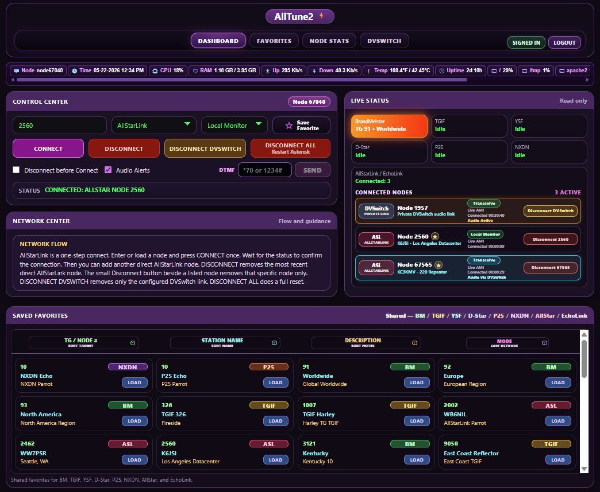

# 🚀 AllTune2

## One Dashboard. All Your Networks.

✅ Optimized for Debian 12 & 13 on 64-bit ARM, including Raspberry Pi 4 and Raspberry Pi 5.

AllTune2 is a modern control panel for **AllStarLink 3 + DVSwitch**.

It gives you one place to work with:

- BrandMeister
- TGIF
- YSF
- D-Star
- P25
- NXDN
- AllStarLink
- EchoLink
- Local Monitor
- Transceive
- Favorites
- Live status and activity
- Audio alerts

Simple. Clean. Powerful.

---

## ✨ WHAT ALLTUNE2 CAN DO

AllTune2 is meant to be a one-screen radio control center.

With it, you can:

- connect to BrandMeister talkgroups
- connect to TGIF talkgroups through the native TGIFD backend
- connect to YSF rooms / reflectors
- connect to D-Star, P25, and NXDN when those modes are enabled and already working on your system
- connect to AllStarLink nodes
- connect to EchoLink nodes
- use Local Monitor or Transceive
- save and load Favorites
- save a new Favorite directly from the dashboard
- use manual entry
- watch live status and activity
- use spoken audio alerts for connects and disconnects

AllTune2 does not replace ASL3, DVSwitch, Analog_Bridge, or MMDVM_Bridge. It controls them from one cleaner dashboard.

---

<p align="center">
  <a href="screenshot.png">
    
  </a>
</p>

<p align="center">
  <em>AllTune2 dashboard with multi-network control, Live Status, Favorites, and connected-node tools.</em>
</p>

---

## 🆕 RECENT UI AND CONTROL IMPROVEMENTS

Recent versions added several important improvements:

- redesigned Control Center layout
- cleaner top navigation buttons
- dashboard **Save Favorite** button
- Save Favorite popup for manual entries
- existing Favorite detection by target + mode
- improved Saved Favorites stability
- Live Status connected-node cards
- Disconnect DVSwitch button in Live Status
- better Local Monitor / Transceive handling for managed DVSwitch modes
- spoken connect/disconnect alerts for managed modes, including D-Star
- Apache security hardening from the installer
- optional web login for public or shared dashboards
- View Only mode when logged out
- disabled Control Center, Favorites actions, and Live Status disconnect buttons while logged out
- friendlier Live Status labels using Saved Favorites and local AllStarLink description data when available
- compact connected-node Favorite star for saving or editing AllStarLink and EchoLink nodes directly from Live Status
- improved Favorites page with sortable columns, row-click editing, visible Edit buttons, and per-row Remove buttons
- Favorites page now preserves the active sort when editing, saving, or removing entries
- improved update lightning bolt that flashes when a newer GitHub version is available
- hardened Apache access-log filter setup so updates safely handle combined AllTune2 + DVSwitch Cockpit polling filters
- native TGIFD backend for TGIF, replacing the older TGIF/HBLink sidecar path

The dashboard is designed so you can pick a network, enter or load a target, choose Local Monitor or Transceive, and press **Connect**.

---

## ⚠️ BEFORE YOU INSTALL

You must already have a working ASL3 / DVSwitch system.

You need:

- Working AllStarLink 3
- Working DVSwitch
- Analog_Bridge installed and running
- MMDVM_Bridge installed and running

Optional modes such as D-Star, P25, and NXDN should already be working in your base DVSwitch setup before enabling them in AllTune2.

If your base node is broken, fix that first. AllTune2 is a control panel, not a repair tool for a broken ASL3 / DVSwitch install.

---

## 📥 INSTALL FIRST TIME

Use this only for a brand-new install:

```bash
cd /var/www/html
sudo git clone https://github.com/TerryClaiborne/alltune2.git alltune2
cd alltune2
sudo ./setup_alltune2.sh
```

The installer may take a little while during dependency checks or while building TGIFD, especially on slower hardware. Wait for the final setup summary before assuming it is stuck.

### What setup does

The setup script helps with:

- permissions
- sudoers rules
- TGIFD build and setup
- config examples
- preserving existing local config files
- helper permissions
- log rotation
- Apache security hardening

The setup script preserves your local config files when they already exist.

A brand-new install may still need you to review and edit:

```text
/var/www/html/alltune2/config.ini
/var/www/html/alltune2/tgif/config/tgifd.ini
```

---

## 🔁 UPDATE / REINSTALL / REBOOT

### Normal code update

For most updates:

```bash
cd /var/www/html/alltune2
git pull origin main
```

### Update that needs setup

Run setup after pulling when the update includes installer, permissions, sudoers, Apache security, TGIFD, or other system-level changes:

```bash
cd /var/www/html/alltune2
git pull origin main
sudo ./setup_alltune2.sh
```
**Note for existing users:** If `git status` shows `M data/favorites.txt` after updating, that is normal on a configured node. It only means your saved Favorites are different from the default file. Do not commit your personal `data/favorites.txt`; just run `git pull origin main` and `sudo ./setup_alltune2.sh` as usual.

### Updating from older TGIF/HBLink releases

AllTune2 now uses TGIFD for TGIF.

When updating from an older AllTune2 release that used the TGIF/HBLink sidecar, run setup after pulling:

```bash
cd /var/www/html/alltune2
git pull origin main
sudo ./setup_alltune2.sh
```

Setup will archive old TGIF/HBLink artifacts out of the live application path and install TGIFD as the active TGIF backend.

### Reboot when needed

A reboot is recommended after updates that affect long-running runtime pieces such as TGIFD, Analog_Bridge, MMDVM_Bridge, or system service behavior.

Do **not** assume every update needs setup. Many updates only need `git pull`.

---

## ✏️ FILES YOU MUST EDIT

### 1. Main config

Edit:

```text
/var/www/html/alltune2/config.ini
```

Example:

```ini
MYNODE="YOUR NODE"
DVSWITCH_NODE="YOUR DVSWITCH NODE"
BM_SelfcarePassword="CHANGE_ME"
TGIF_HotspotSecurityKey="CHANGE_ME"
DSTAR_ENABLED=0
P25_ENABLED=0
NXDN_ENABLED=0
ALLTUNE2_AUTH_ENABLED=0
ALLTUNE2_ADMIN_USER="admin"
ALLTUNE2_ADMIN_PASSWORD_HASH=""
```

### Main config values

**MYNODE**  
Your main AllStar node number.

**DVSWITCH_NODE**  
Your private DVSwitch audio node. Many systems use `1999` or `1998`, but use whatever your system is actually configured to use.

**BM_SelfcarePassword**  
Your BrandMeister SelfCare password.

**TGIF_HotspotSecurityKey**  
Your TGIF Hotspot Security Key. This is **not** your TGIF website login password.

**DSTAR_ENABLED**  
Set to `1` only if D-Star already works on your ASL3 / DVSwitch system.

**P25_ENABLED** and **NXDN_ENABLED**  
Set these to `1` only if those modes already work on your ASL3 / DVSwitch system.

Leave optional modes disabled if you do not use them:

```ini
DSTAR_ENABLED=0
P25_ENABLED=0
NXDN_ENABLED=0
```

**ALLTUNE2_AUTH_ENABLED**  
Controls the optional AllTune2 web login.

Use:

```ini
ALLTUNE2_AUTH_ENABLED=0
```

to keep AllTune2 in normal no-login mode.

Use:

```ini
ALLTUNE2_AUTH_ENABLED=1
```

to require login before users can control the node.

**ALLTUNE2_ADMIN_USER**  
The single web login username. AllTune2 currently uses one admin account.

Default:

```ini
ALLTUNE2_ADMIN_USER="admin"
```

**ALLTUNE2_ADMIN_PASSWORD_HASH**  
The saved password hash for the AllTune2 web login.

Do **not** type a plain password here.

Normal users should create or change this hash with:

```bash
sudo /var/www/html/alltune2/setup_alltune2.sh --set-admin-password
```

The setup script creates the hash automatically. The plain password is not stored.

---

## 🔐 OPTIONAL WEB LOGIN

AllTune2 can run with or without web login.

### No Login / Normal mode

When this is set:

```ini
ALLTUNE2_AUTH_ENABLED=0
```

AllTune2 works like the normal dashboard. Controls are available without signing in.

### View Only mode

When web login is enabled and you are logged out, AllTune2 shows View Only behavior.

In View Only mode:

- the dashboard still loads
- live status still loads
- saved Favorites are visible
- the Control Center is disabled
- Dashboard Favorites are view-only
- Live Status disconnect buttons are disabled
- Favorites page add/edit/remove actions require login
- connect, disconnect, DTMF, and save actions are blocked

### Login / Sign In

Click **Login** and enter the single admin password.

After signing in, the Control Center, Favorites actions, DTMF, connect, and disconnect controls are available.

### Logout

Click **Logout** to return AllTune2 to View Only mode.

### Set or change the web login password

Run:

```bash
sudo /var/www/html/alltune2/setup_alltune2.sh --set-admin-password
```

This asks for a new admin password, creates the password hash automatically, stores the hash in `config.ini`, and enables web login.

### Disable web login

Run:

```bash
sudo /var/www/html/alltune2/setup_alltune2.sh --disable-auth
```

This sets:

```ini
ALLTUNE2_AUTH_ENABLED=0
```

The existing password hash is kept, so login can be re-enabled later without creating a new password.

Normal setup/update does **not** ask for a password and does **not** change the saved web login settings.

---

## 🟢 TGIF CONFIG

AllTune2 now uses **TGIFD** for TGIF.

TGIFD replaces the older TGIF/HBLink sidecar path. In testing, TGIFD reduced the TGIF runtime footprint, removed the local Python/HBLink stack, reduced disk usage, reduced CPU load compared with the previous sidecar approach, and provided cleaner TGIF audio.

Edit:

```text
/var/www/html/alltune2/tgif/config/tgifd.ini
```

Example:

```ini
[general]
log_file=./tgifd.log

[identity]
callsign=YOURCALL
dmr_id=YOUR_DMR_ID
hotspot_radio_id=YOUR_HOTSPOT_ID_PLUS_1

[tgif]
host=tgif.network
port=62031
security_key=YOUR_TGIF_SECURITY_KEY
startup_tg=9990
options=StartRef=9990;RelinkTime=60

[behavior]
receive_timeout_ms=1000
keepalive_seconds=5
protocol_assert_seconds=30
soft_refresh_trigger_missed=2
max_missed=5
reconnect_delay_seconds=5

[network]
local_bind_port=0

[tlv]
rx_port=31103
tx_host=127.0.0.1
tx_port=31100
timeout_ms=500
inbound_slot=2

[private_node]
enabled=true
asterisk_bin=/usr/sbin/asterisk
mynode=YOUR_ALLSTAR_NODE
private_node=YOUR_DVSWITCH_NODE
autoload_mode=transceive

[mmdvm]
rx_frequency=0
tx_frequency=0
power=5
color_code=1
latitude=0.000000
longitude=0.000000
height=0
location=Your Location
description=TGIFD via AllTune2
slots=2
url=https://github.com/TerryClaiborne/alltune2
version=alltune2-tgifd
software=TGIFD
```

### TGIFD values

**callsign**  
Your ham callsign.

Example:

```text
callsign=YOURCALL
```

**dmr_id**  
Your gateway/base DMR ID.

On many DVSwitch systems this is the same DMR ID used by Analog_Bridge as the gateway DMR ID.

Example:

```ini
dmr_id=3101234
```

**hotspot_radio_id**  
Your TGIF hotspot/radio ID for this bridge.

For the AllTune2 TGIFD path, this is usually your hotspot ID plus 1.

Example:

```text
Your hotspot ID: 330000811
Use:             330000812
```

Another example:

```text
Your hotspot ID: 3101234
Use:             3101235
```

Do **not** blindly use your original hotspot ID unchanged unless your setup specifically requires that. Use the ID pattern that is correct for your DVSwitch / TGIF setup.

**security_key**  
Your TGIF Hotspot Security Key.

This is **not** your TGIF website login password.

This should match the TGIF key you set in `config.ini`:

```ini
TGIF_HotspotSecurityKey="CHANGE_ME"
```

**startup_tg**  
The TGIF talkgroup TGIFD should start on when launched directly.

Example:

```ini
startup_tg=9990
```

**options**  
TGIF startup options.

Example:

```ini
options=StartRef=9990;RelinkTime=60
```

For another startup talkgroup:

```ini
startup_tg=9050
options=StartRef=9050;RelinkTime=60
```

**inbound_slot**  
This must stay set to `2`:

```ini
inbound_slot=2
```

AllTune2/TGIFD uses this for reliable inbound TGIF audio through the TLV/DVSwitch path. Do not remove it.

**mynode**  
Your main AllStar node number. This should match `MYNODE` in `config.ini`.

**private_node**  
Your private DVSwitch audio node. This should match `DVSWITCH_NODE` in `config.ini`.

**autoload_mode**  
Controls how TGIFD links the private DVSwitch node.

Typical value:

```ini
autoload_mode=transceive
```

**rx_frequency / tx_frequency / latitude / longitude / height / location / description**  
These are MMDVM/TGIF descriptive values.

If your existing MMDVM_Bridge configuration has valid values, setup may copy some of them. If you are not running a repeater, frequency values of `0` are usually fine.

### Important TGIF note

TGIF and BrandMeister are separate networks. A talkgroup number existing on TGIF does not automatically mean you will hear users who are connected through BrandMeister.

Use BrandMeister in AllTune2 when you want the BrandMeister side. Use TGIF when you want the TGIF side.

### TGIFD backend notes

TGIFD is the AllTune2 TGIF backend.

The old TGIF/HBLink sidecar path has been removed from the release tree. During an update from an older AllTune2 release, setup archives old TGIF/HBLink artifacts out of the live application path before installing TGIFD.

TGIFD runtime files are local-only and should not be committed:

```text
/var/www/html/alltune2/tgif/config/tgifd.ini
/var/www/html/alltune2/tgif/build/
/var/www/html/alltune2/tgif/*.log
/var/www/html/alltune2/logs/tgifd-helper.log
/var/www/html/alltune2/run/
```

The public example file is:

```text
/var/www/html/alltune2/tgif/config/tgifd.ini.example
```

---

## 🟠 OPTIONAL D-STAR / P25 / NXDN

D-Star, P25, and NXDN are optional.

Enable them in AllTune2 only if they already work in your base DVSwitch / MMDVM_Bridge setup.

```ini
DSTAR_ENABLED=1
P25_ENABLED=1
NXDN_ENABLED=1
```

If a mode is disabled or not configured, it will not be available in the main dropdown or Favorites. Its Live Status box may still appear, but it will stay idle.

AllTune2 does not create your D-Star registration, P25 setup, NXDN setup, reflector setup, or base MMDVM_Bridge mode configuration. It controls those modes after your base system is already working.

---

## 🚫 DO NOT EDIT THESE UNLESS YOU KNOW WHY

These files belong to the underlying DVSwitch system:

- `/opt/MMDVM_Bridge/DVSwitch.ini`
- `/opt/MMDVM_Bridge/MMDVM_Bridge.ini`
- `/opt/Analog_Bridge/Analog_Bridge.ini`

If those files are wrong, AllTune2 may not work correctly.

---

## 🌐 OPEN ALLTUNE2 IN YOUR BROWSER

Example:

```text
http://192.168.1.120/alltune2/public/
```

The full path also works:

```text
http://192.168.1.120/alltune2/public/index.php
```

Replace `192.168.1.120` with your node IP address or hostname.

### Outside access and HTTPS

For outside access, the safest recommendation is still Tailscale, a VPN, or another private tunnel you control.

If you want public browser access, use a real hostname or DDNS name with a trusted HTTPS certificate.

Example:

```text
https://your-ddns-name/alltune2/public/
```

A DDNS name alone does not create trusted HTTPS. Apache still needs a trusted certificate for that hostname, such as a Let’s Encrypt certificate.

A common Let’s Encrypt / Certbot path is:

```bash
sudo apt-get install certbot python3-certbot-apache
sudo certbot --apache -d your-ddns-name
sudo certbot renew --dry-run
```

A self-signed or snakeoil certificate can still protect the connection technically, but browsers will show a warning.

Raw public IP HTTPS is not recommended for normal users because browser-trusted certificates are normally issued for hostnames, not plain IP addresses.

If you expose AllTune2 through public 80/443, keep web login enabled.

---

## 🖥️ HOW TO USE ALLTUNE2

Basic use:

- choose the network or mode
- choose Local Monitor or Transceive if needed
- enter a target or choose a Favorite
- press **Connect**
- watch Live Status and Activity
- press **Disconnect**, **Disconnect DVSwitch**, or **Disconnect All** when needed

### Control Center

The Control Center is where you select the network, target, and Link Mode.

The Link Mode dropdown controls how the private DVSwitch audio node is linked:

- **Local Monitor** for monitoring/listening use
- **Transceive** for normal radio-side transmit/receive use

AllTune2 now re-applies the selected Link Mode when changing between supported managed modes, so you should not normally have to press Disconnect DVSwitch just to change Local Monitor / Transceive.

If web login is enabled and you are logged out, the Control Center is disabled until you sign in.

---

## 🔵 BRANDMEISTER

Use BrandMeister for BM talkgroups.

Typical workflow:

- choose BrandMeister
- enter a talkgroup or choose a BM Favorite
- press Connect
- wait for status to show the connection

To change BM talkgroups:

- enter a new talkgroup **or choose another BM Favorite**
- press Connect again

BrandMeister is usually one of the faster paths.

---

## 🟢 TGIF

Use TGIF for TGIF talkgroups.

Typical workflow:

- choose TGIF
- enter a talkgroup or choose a TGIF Favorite
- press Connect
- wait for the TGIF path to come up

To change TGIF talkgroups:

- enter a new talkgroup **or choose another TGIF Favorite**
- press Connect again

TGIF may take a little longer than BrandMeister to connect or disconnect. TGIFD starts, links the private DVSwitch audio node when needed, tunes TGIF, and then reports status back to the dashboard.

---

## 🟡 YSF

Use YSF for YSF rooms / reflectors.

Typical workflow:

- choose YSF
- enter the YSF target or choose a YSF Favorite
- press Connect
- watch Live Status

---

## 🟠 D-STAR

Use D-Star for D-Star reflectors when D-Star is enabled and working on your system.

Typical workflow:

- make sure `DSTAR_ENABLED=1` is set in `config.ini`
- choose D-Star
- enter the D-Star target or choose a D-Star Favorite
- press Connect
- watch Live Status

---

## 🟤 P25

Use P25 when P25 is enabled and working on your system.

Typical workflow:

- make sure `P25_ENABLED=1` is set in `config.ini`
- choose P25
- enter the P25 target or choose a P25 Favorite
- press Connect
- watch Live Status

---

## ⚫ NXDN

Use NXDN when NXDN is enabled and working on your system.

Typical workflow:

- make sure `NXDN_ENABLED=1` is set in `config.ini`
- choose NXDN
- enter the NXDN target or choose a NXDN Favorite
- press Connect
- watch Live Status

---

## 🔴 ALLSTARLINK

Use AllStarLink for direct AllStar node connections.

Typical workflow:

- choose AllStarLink
- enter the node number or choose an AllStarLink Favorite
- press Connect
- watch Live Status
- disconnect when done

---

## 🟣 ECHOLINK

Use EchoLink for EchoLink node connections.

Typical workflow:

- choose EchoLink
- enter the EchoLink node number or choose an EchoLink Favorite
- press Connect
- watch Live Status
- disconnect when done

---

## ⭐ FAVORITES

Favorites save time.

Favorites can be used for:

- BM talkgroups
- TGIF talkgroups
- YSF targets
- D-Star targets
- P25 targets
- NXDN targets
- AllStarLink nodes
- EchoLink nodes

### Loading a Favorite

- click or choose the Favorite
- AllTune2 fills in the target and mode
- press Connect

### Saving a Favorite from the dashboard

The dashboard includes a **Save Favorite** button.

Use it when you manually type a target and want to save it.

If the same target and mode already exist, AllTune2 shows that it found an existing Favorite and lets you update it instead of creating a duplicate.

When web login is enabled and you are logged out, Favorites are visible but view-only. Clicking a dashboard Favorite does not load it into the Control Center until you sign in.

### Favorites file

Your live Favorites file is local user data:

```text
/var/www/html/alltune2/data/favorites.txt
```

This file is intentionally ignored by Git.

A neutral example file is included for reference:

```text
/var/www/html/alltune2/data/favorites.example.txt
```

Do not commit your live `favorites.txt`.

---

## 📝 MANUAL ENTRY

Manual entry is useful when:

- you are testing a target
- you are trying something once
- you do not want to save it yet

Enter the target, choose the mode, then press Connect.

---

## 📊 LIVE STATUS AND ACTIVITY

Live Status helps show:

- current network / mode
- active target
- private DVSwitch link state
- AllStarLink / EchoLink connected nodes
- keyed or active rows when activity is detected
- D-Star, P25, and NXDN status when configured

The **Disconnect DVSwitch** button removes the private DVSwitch link without doing a full Asterisk restart.

The **Disconnect All** button performs a full reset and restarts Asterisk.

When web login is enabled and you are logged out, Live Status remains visible but its disconnect buttons are disabled.

---

## 🔊 AUDIO ALERTS

Audio alerts can announce connects and disconnects.

They can be helpful when monitoring node activity without staring at the screen.

Recent updates improved connect/disconnect alerts for managed digital modes, including D-Star.

---

## 🔐 SECURITY HARDENING

The setup script installs Apache protection for sensitive AllTune2 files and folders.

This helps block direct browser access to local config, git, helper, runtime, log, and data files while still allowing the public dashboard and API to work.

This is handled by the installer when Apache is available.

Recent security work also added optional web login, hardened session handling, CSRF protection for write actions, and API guards for control actions.

The installer also protects the local `tools/` directory from direct browser access.

---

## 🔧 TROUBLESHOOTING BASICS

### If audio stops

Try restarting Analog_Bridge:

```bash
sudo systemctl restart analog_bridge
```

### If TGIF does not connect

Check:

- `/var/www/html/alltune2/config.ini`
- `/var/www/html/alltune2/tgif/config/tgifd.ini`
- `/var/www/html/alltune2/logs/tgifd-helper.log`
- `/var/www/html/alltune2/tgif/tgifd.log`

Check TGIFD helper status:

```bash
sudo /var/www/html/alltune2/tgif/alltune2-tgifd-helper.sh status
```

TGIF may take longer than some other modes to start or stop. Wait for status to finish before clicking repeatedly.

### If TGIF connects but inbound audio is unreliable

Check that this line exists under `[tlv]` in:

```text
/var/www/html/alltune2/tgif/config/tgifd.ini
```

Required value:

```ini
inbound_slot=2
```

Also confirm your TGIFD identity values are correct:

```ini
callsign=YOURCALL
dmr_id=YOUR_DMR_ID
hotspot_radio_id=YOUR_HOTSPOT_ID_PLUS_1
security_key=YOUR_TGIF_SECURITY_KEY
```

The `hotspot_radio_id` is usually your hotspot ID plus 1.

### If D-Star, P25, or NXDN does not show up

Check:

- the mode is enabled in `config.ini`
- your real `MYNODE` and `DVSWITCH_NODE` are set
- `/opt/MMDVM_Bridge/dvswitch.sh` exists
- the mode already works in the underlying DVSwitch setup

### If web login does not work

Check the auth settings:

```bash
grep -nE 'ALLTUNE2_AUTH_ENABLED|ALLTUNE2_ADMIN_USER|ALLTUNE2_ADMIN_PASSWORD_HASH' /var/www/html/alltune2/config.ini
```

To set or change the web login password:

```bash
sudo /var/www/html/alltune2/setup_alltune2.sh --set-admin-password
```

To disable web login:

```bash
sudo /var/www/html/alltune2/setup_alltune2.sh --disable-auth
```

### If HTTPS shows a certificate warning

Make sure you are browsing to the same hostname used by the certificate.

For example, if your AllTune2 address is:

```text
https://my-node.ddns.net/alltune2/public/
```

then the hostname is:

```text
my-node.ddns.net
```

Check the certificate with `openssl`.

For the example above, you would run:

```bash
openssl s_client -connect my-node.ddns.net:443 -servername my-node.ddns.net </dev/null 2>/dev/null \
  | openssl x509 -noout -subject -issuer -dates -ext subjectAltName
```

What you want to see is something like:

```text
subject=CN=my-node.ddns.net
issuer=Let's Encrypt
X509v3 Subject Alternative Name:
    DNS:my-node.ddns.net
```

If the certificate says `node.local`, `node.example.local`, or `snakeoil`, Apache is still serving a self-signed certificate and the browser will show a warning.

If the certificate says your router brand name, your router is probably answering ports 80/443 instead of forwarding them to the node.

Use a DDNS/domain hostname with a trusted certificate, or use Tailscale/VPN.

### If an update behaves strangely

For code-only updates, `git pull` is usually enough.

If setup, permissions, sudoers, Apache security, TGIFD, or runtime helpers changed, run:

```bash
cd /var/www/html/alltune2
sudo ./setup_alltune2.sh
```

If TGIFD runtime code changed, rebooting once after the update is recommended.

---

## 🧠 SIMPLE RULES

Edit these:

- `/var/www/html/alltune2/config.ini`
- `/var/www/html/alltune2/tgif/config/tgifd.ini`

Review these if TGIF needs troubleshooting:

- `/var/www/html/alltune2/logs/tgifd-helper.log`
- `/var/www/html/alltune2/tgif/tgifd.log`

Leave these alone unless you know why:

- `/opt/MMDVM_Bridge/DVSwitch.ini`
- `/opt/MMDVM_Bridge/MMDVM_Bridge.ini`
- `/opt/Analog_Bridge/Analog_Bridge.ini`

Remember:

- do not guess values
- do not paste passwords publicly
- do not commit `config.ini`
- do not commit `data/favorites.txt`
- do not commit `tgif/config/tgifd.ini`
- do not commit `tgif/build/`
- do not assume every update needs setup
- use `--set-admin-password` to change the web login password
- use `--disable-auth` to turn web login off
- keep web login enabled if AllTune2 is exposed through public 80/443
- prefer Tailscale/VPN for outside access
- use DDNS/domain plus trusted HTTPS for public browser access
- enable D-Star, P25, or NXDN only when those modes already work on your base system
- keep `[tlv] inbound_slot=2` in `tgifd.ini`
- set `hotspot_radio_id` correctly for your TGIF/DVSwitch identity

---

## ✅ DONE

Install → Configure → Open in browser → Connect → Enjoy

---

### Contact

Questions? Email: [kc3kmv@yahoo.com](mailto:kc3kmv@yahoo.com)

---

## ⚠️ IMPORTANT UPDATE NOTES

Recent release series highlights:

- redesigned Control Center
- dashboard Save Favorite workflow
- top navigation polish
- Apache security hardening
- STFU/BM log rotation support
- D-Star, P25, and NXDN support when enabled
- Live Status improvements
- managed Local Monitor / Transceive link-mode fixes
- D-Star/P25/NXDN audio-alert improvements
- native TGIFD backend replacing the older TGIF/HBLink path
- lower TGIF runtime footprint by removing the Python/HBLink sidecar stack
- reduced CPU load and disk usage for the TGIF path compared with the old sidecar approach
- improved TGIF audio quality in testing
- TGIFD installer/build support
- TGIFD log rotation and runtime config protection
- TGIF inbound audio reliability fix using `[tlv] inbound_slot=2`

For most updates:

```bash
cd /var/www/html/alltune2
git pull origin main
```

Run setup when the release includes install/setup/system-level changes:

```bash
sudo ./setup_alltune2.sh
```

For this TGIFD release, run setup after pulling:

```bash
cd /var/www/html/alltune2
git pull origin main
sudo ./setup_alltune2.sh
```

For web login password changes:

```bash
sudo /var/www/html/alltune2/setup_alltune2.sh --set-admin-password
```

For disabling web login:

```bash
sudo /var/www/html/alltune2/setup_alltune2.sh --disable-auth
```

Normal setup/update preserves existing web login settings and does not ask for a web password.
